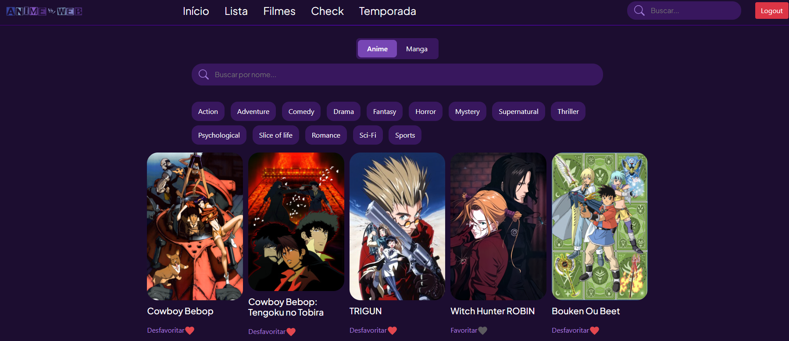

# AnimeWEB

Estou fazendo esse projeto para ajudar os meus estudos na parte prática,
ele envolve o uso do Spring Boot, banco de dados e comunicações com APIs
externas. Meu objetivo é criar um modelo semelhante ao myAnimeList, 
que permita aos usuários descobrir novos títulos de anime e salvar 
em uma lista privada.

## Tecnologias utilizadas

- Java
- Spring Boot
  - Spring Security
- MySQL
  - MariaDB
- JPA
- Hibernate
- Thymeleaf
- HTML e CSS
- JavaScript
- Gradle
- AniList API
- Lombok

## Autores

- [@grutukyl](https://www.github.com/octokatherine)

